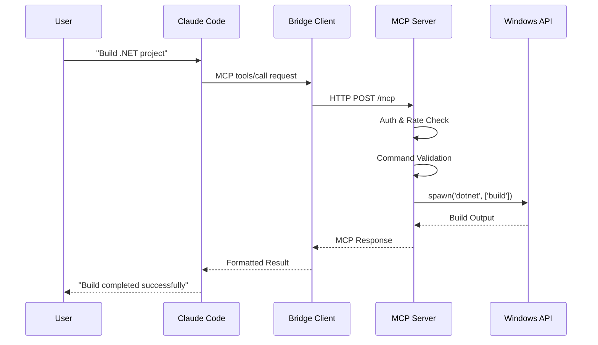
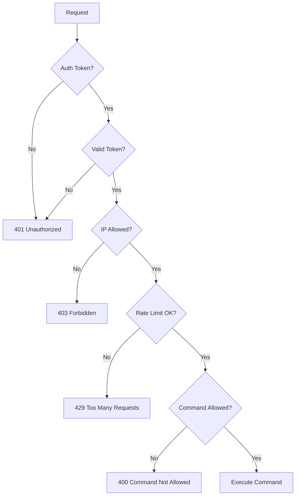

# Windows MCP Server - アーキテクチャドキュメント v1.0.6

## 📐 システム概要

Windows MCP Serverは、MCP（Model Context Protocol）を実装した分散アーキテクチャシステムです。macOS/LinuxクライアントからWindows環境でのリモート開発・ビルド・デプロイを可能にします。

## 🏗️ アーキテクチャ図

```
┌─────────────────┐    ┌─────────────────┐    ┌─────────────────┐
│   MCP Client    │    │  Bridge Client  │    │  Windows Server │
│                 │    │                 │    │                 │
│ ┌─────────────┐ │    │ ┌─────────────┐ │    │ ┌─────────────┐ │
│ │Claude Code  │ │    │ │mcp-client.js│ │    │ │ server.js   │ │
│ │Gemini-CLI   │ │◄──►│ │             │ │◄──►│ │             │ │
│ │Other MCP    │ │    │ │ HTTP Client │ │    │ │Express+MCP  │ │
│ │Tools        │ │    │ │ Auth Mgr    │ │    │ │ Protocol    │ │
│ └─────────────┘ │    │ └─────────────┘ │    │ └─────────────┘ │
└─────────────────┘    └─────────────────┘    └─────────────────┘
      macOS/Linux            macOS/Linux              Windows VM
```

## 🔧 コンポーネント詳細

### 1. MCPクライアント層
- **役割**: ユーザーインターフェース
- **対応ツール**: Claude Code, Gemini-CLI, カスタムMCPクライアント
- **プロトコル**: MCP over stdio/HTTP
- **機能**: 自然言語→MCPコマンド変換

### 2. ブリッジクライアント層
- **ファイル**: `client/src/mcp-client.js`
- **役割**: MCPプロトコル変換とHTTP通信
- **認証**: Bearer token管理
- **設定**: 環境変数による動的設定

### 3. Windows MCP Server層
- **ファイル**: `server/src/server.js`
- **役割**: MCPプロトコル実装とWindows API統合
- **フレームワーク**: Express.js + Node.js
- **セキュリティ**: 多層防御アーキテクチャ

## 🛡️ セキュリティアーキテクチャ

```
Request Flow:
┌─────────────┐    ┌─────────────┐    ┌─────────────┐    ┌─────────────┐
│   Client    │───►│    Auth     │───►│Rate Limiter │───►│   Router    │
│   Request   │    │ Validator   │    │   Check     │    │  Handler    │
└─────────────┘    └─────────────┘    └─────────────┘    └─────────────┘
                           │                   │                   │
                           ▼                   ▼                   ▼
                   ┌─────────────┐    ┌─────────────┐    ┌─────────────┐
                   │   Token     │    │    Rate     │    │  Command    │
                   │ Validation  │    │  Tracking   │    │ Validation  │
                   └─────────────┘    └─────────────┘    └─────────────┘
                           │                   │                   │
                           ▼                   ▼                   ▼
                   ┌─────────────────────────────────────────────────────┐
                   │             Security Logger                         │
                   │  access.log | security.log | error.log | app.log   │
                   └─────────────────────────────────────────────────────┘
```

### セキュリティレイヤー

#### 1. 認証レイヤー
- **Bearer Token認証**: 32文字ランダムトークン
- **IPアドレス制限**: CIDR形式ホワイトリスト
- **セッション管理**: ステートレス認証

#### 2. 認可レイヤー
- **コマンド検証**: ホワイトリスト方式
- **パス制限**: ディレクトリトラバーサル対策
- **権限分離**: 通常/開発/危険モード

#### 3. レート制限レイヤー
- **適応型制限**: セキュリティモードに応じた動的制御
- **IPベース追跡**: メモリ内カウンター
- **危険モード例外**: 開発効率優先

#### 4. ログ・監査レイヤー
- **構造化ログ**: JSON形式での詳細記録
- **ローテーション**: サイズベース自動ローテーション
- **分類別保存**: アクセス・セキュリティ・エラー・アプリケーション

## 🗂️ ディレクトリ構造

```
make-windows-mcp/
├── client/                    # クライアント側コンポーネント
│   ├── src/
│   │   └── mcp-client.js     # MCPブリッジクライアント
│   ├── setup/
│   │   └── production-setup.js
│   └── package.json
├── server/                    # サーバー側コンポーネント
│   ├── src/
│   │   ├── server.js         # メインサーバー実装
│   │   └── utils/            # ユーティリティモジュール
│   │       ├── security.js   # セキュリティ検証
│   │       ├── logger.js     # 構造化ログ
│   │       ├── rate-limiter.js
│   │       ├── crypto.js     # 暗号化機能
│   │       └── helpers.js    # 共通ヘルパー
│   ├── setup/
│   │   ├── windows-setup.ps1 # Windows環境セットアップ
│   │   └── update-from-git.ps1
│   └── package.json
├── tests/                     # テストスイート
├── docs/                      # ドキュメント
└── examples/                  # サンプルプロジェクト
```

## 🔄 データフロー

### 1. 基本的なコマンド実行フロー



### 2. セキュリティ検証フロー



## 📦 モジュール設計

### 1. server.js - メインサーバー
```javascript
// 主要責務
- MCPプロトコル実装
- HTTPサーバー管理
- ルーティング制御
- ツール実行管理
- エラーハンドリング

// 依存関係
- Express.js (HTTP server)
- child_process (外部コマンド実行)
- SSH2 (リモート接続)
- ping (ネットワーク診断)
```

### 2. utils/security.js - セキュリティ検証
```javascript
class SecurityValidator {
  // コマンド検証
  validatePowerShellCommand(command)
  validateBuildPath(path)
  validateBatchFilePath(path)
  validateIPAddress(ip)
  validateSSHCredentials(host, user, pass)
  
  // セキュリティモード制御
  isDangerousMode()
  isDevelopmentMode()
  isAllowedCommand(command)
}
```

### 3. utils/logger.js - 構造化ログ
```javascript
class Logger {
  // ログレベル
  error(message, metadata)
  warn(message, metadata)
  info(message, metadata)
  debug(message, metadata)
  
  // 特別なログ
  security(event, details)
  access(req, res, duration)
  
  // ファイル管理
  rotateLogFile(filePath)
  createLogDirectory()
}
```

### 4. utils/rate-limiter.js - レート制限
```javascript
class RateLimiter {
  checkRateLimit(clientIP)
  resetRateLimit(clientIP)
  getRemainingRequests(clientIP)
  
  // 設定
  requestsPerWindow: 60
  windowMs: 60000
  cleanupInterval: 300000
}
```

### 5. utils/crypto.js - 暗号化
```javascript
class CryptoManager {
  // 暗号化
  encrypt(text)
  decrypt(encryptedData)
  
  // ハッシュ
  hashForLogging(sensitive)
  
  // 鍵管理
  initializeKey()
  generateSalt()
}
```

## 🌐 ネットワークアーキテクチャ

### 1. 基本構成
```
Internet
    │
    ▼
┌─────────────┐
│  Firewall   │ Port 8080 (configurable)
└─────────────┘
    │
    ▼
┌─────────────┐
│Windows VM   │ 192.168.x.x
│MCP Server   │ 
└─────────────┘
```

### 2. NordVPN メッシュネットワーク構成
```
        Internet
            │
    ┌───────┼───────┐
    ▼       ▼       ▼
┌─────┐ ┌─────┐ ┌─────┐
│VM-1 │ │VM-2 │ │VM-3 │
│10.5 │ │10.5 │ │10.5 │
│.0.1 │ │.0.2 │ │.0.3 │
└─────┘ └─────┘ └─────┘
    │       │       │
    └───────┼───────┘
            │
    Mesh Network
    10.5.0.0/24
```

### 3. ポート設定
| サービス | ポート | プロトコル | 用途 |
|---------|-------|----------|------|
| MCP Server | 8080 | HTTP | メインAPI |
| SSH | 22 | TCP | リモート管理 |
| RDP | 3389 | TCP | GUI接続 |
| Custom | 3000-3010 | HTTP | 開発用 |

## 💾 データ管理

### 1. 設定管理
```javascript
// 環境変数による設定
process.env.MCP_AUTH_TOKEN        // 認証トークン
process.env.ALLOWED_IPS           // IP制限
process.env.ALLOWED_BUILD_PATHS   // ビルドパス制限
process.env.ALLOWED_BATCH_DIRS    // バッチファイル制限
process.env.ENABLE_DEV_COMMANDS   // 開発モード
process.env.ENABLE_DANGEROUS_MODE // 危険モード
```

### 2. ログデータ
```
server/src/logs/
├── access.log      # HTTP アクセスログ
├── security.log    # セキュリティイベント
├── error.log       # エラーログ
├── app.log         # アプリケーションログ
└── debug.log       # デバッグ情報
```

### 3. 一時データ
- **レート制限カウンター**: メモリ内Map
- **SSH接続プール**: 接続再利用
- **プロセス追跡**: 実行中コマンドの管理

## 🔧 拡張性設計

### 1. 新ツールの追加
```javascript
// server.js内のtools配列に追加
{
  name: 'new_tool',
  description: 'New tool description',
  inputSchema: {
    type: 'object',
    properties: {
      param1: { type: 'string' },
      param2: { type: 'number' }
    },
    required: ['param1']
  }
}

// tools/call switch文にケース追加
case 'new_tool':
  // Implementation
  break;
```

### 2. セキュリティポリシーの拡張
```javascript
// security.js内の配列に追加
this.allowedCommands.push('new-command');
this.dangerousPatterns.push(/dangerous-pattern/gi);
```

### 3. 認証方式の拡張
- OAuth 2.0統合の準備
- LDAP/Active Directory連携
- 証明書ベース認証

## 📊 パフォーマンス設計

### 1. 応答時間目標
| 操作タイプ | 目標応答時間 |
|-----------|-------------|
| 基本コマンド | < 1秒 |
| ビルド操作 | < 300秒 |
| ファイル同期 | 10MB/秒 |
| SSH接続 | < 5秒 |

### 2. スケーラビリティ
- **水平スケーリング**: 複数Windows VMの負荷分散
- **垂直スケーリング**: CPU/メモリ増強による性能向上
- **キャッシュ戦略**: ビルド結果のキャッシュ

### 3. リソース監視
```javascript
// メモリ使用量監視
process.memoryUsage()

// CPU使用率監視
process.cpuUsage()

// イベントループ遅延
setImmediate(() => {
  // 遅延測定
});
```

## 🔄 障害対策・復旧

### 1. 障害検知
- **ヘルスチェックエンドポイント**: `/health`
- **アプリケーション監視**: プロセス死活監視
- **リソース監視**: CPU・メモリ・ディスク使用率

### 2. 自動復旧
```javascript
// プロセス自動再起動
process.on('uncaughtException', (error) => {
  logger.error('Uncaught exception', { error: error.stack });
  // グレースフルシャットダウン後再起動
});

// メモリリーク対策
setInterval(() => {
  if (process.memoryUsage().heapUsed > MEMORY_THRESHOLD) {
    // メモリクリーンアップ
  }
}, 60000);
```

### 3. バックアップ戦略
- **設定ファイル**: 自動バックアップ
- **ログファイル**: ローテーション保存
- **アプリケーション**: Git履歴管理

## 📈 監視・メトリクス

### 1. 基本メトリクス
- **リクエスト数**: 時間あたりのAPI呼び出し
- **応答時間**: 95パーセンタイル
- **エラー率**: 4xx/5xx レスポンス率
- **同時接続数**: アクティブセッション数

### 2. ビジネスメトリクス
- **ビルド成功率**: 成功/失敗比率
- **ツール使用率**: ツール別使用頻度
- **セキュリティイベント**: 異常アクセス検知

### 3. インフラメトリクス
- **CPU使用率**: プロセスCPU消費
- **メモリ使用率**: ヒープメモリ使用量
- **ディスクI/O**: ログ書き込み負荷
- **ネットワーク**: 帯域幅使用量

## 🚀 デプロイメント戦略

### 1. 本番デプロイ
```powershell
# 本番環境設定
$env:NODE_ENV = "production"
$env:MCP_AUTH_TOKEN = "secure-random-token"
$env:ALLOWED_IPS = "192.168.1.0/24"

# サービス登録
New-Service -Name "MCPServer" -BinaryPathName "node server.js"
```

### 2. 開発環境
```bash
# 開発モード起動
ENABLE_DEV_COMMANDS=true npm run dev

# 危険モード（テスト用）
ENABLE_DANGEROUS_MODE=true npm start
```

### 3. 継続的インテグレーション
- **自動テスト**: Jest + カバレッジ
- **静的解析**: ESLint + セキュリティ検査
- **自動デプロイ**: GitHub Actions

---

## 📚 技術スタック

| 層 | 技術 | バージョン | 用途 |
|----|------|----------|------|
| **ランタイム** | Node.js | 18+ | JavaScriptランタイム |
| **Webフレームワーク** | Express.js | 4.x | HTTPサーバー |
| **セキュリティ** | Helmet | 7.x | HTTPヘッダーセキュリティ |
| **暗号化** | Node Crypto | Built-in | AES暗号化 |
| **SSH** | SSH2 | 1.16+ | リモート接続 |
| **テスト** | Jest | 29.x | ユニット・統合テスト |
| **ログ** | Custom Logger | - | 構造化ログ |
| **プロセス管理** | Child Process | Built-in | 外部コマンド実行 |

---

**Windows MCP Server v1.0.6**  
**アーキテクチャ更新日: 2025-07-04**  
**エンタープライズレベルの分散アーキテクチャで、安全性と拡張性を両立**